# How (not) to (use) AI

---

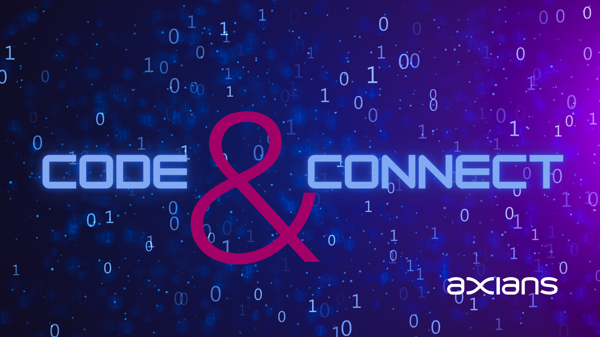

---
# What are we talking about 
```
$ whoami
Wtf is AI
Machine vision
Larry
Generative AI
Unsupervised AI
Manufacturing
Hardware & Platform
Take it to the cloud
```
---
```bash
tleilaxu@axians:~$ whoami
Name: Kenneth Van den Driessche
Work: Axians
Time: 5y1m1d19h
Current job: Consultant@Pfizer
```
---
Previously:
Social media platform developement @ travel sector
Development of backoffice software and network architecture @ event sector
Create a more data-driven organisation @ shipping

---

Be customer oriented
Be team fix it - deadlines not optional
Data is valuable

---
# Smart factory technology Innovation Technical consultant

---

# Machine vision

---

#### Deep learning vs traditional Computer vision

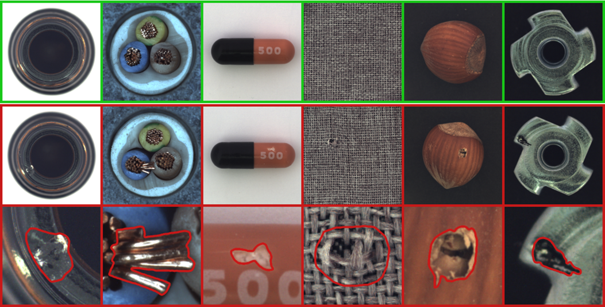

---


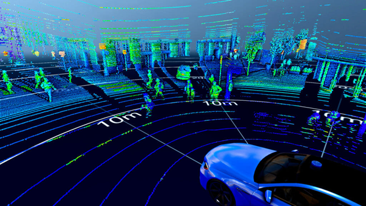

---

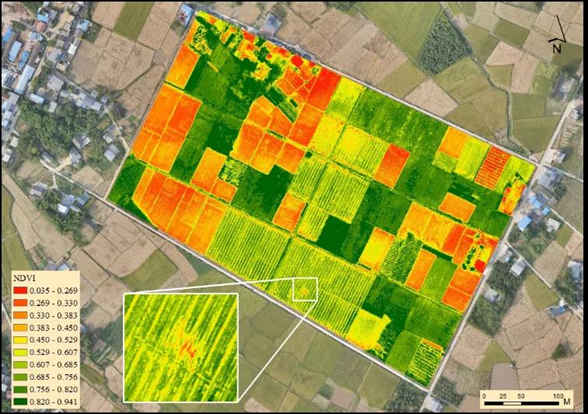
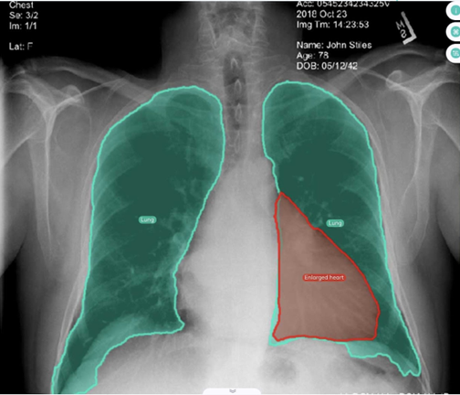


---
### Pose estimation
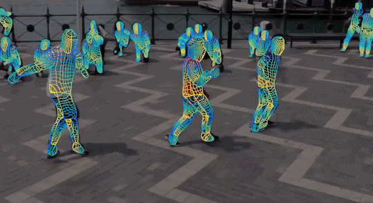

---

### PPE detection

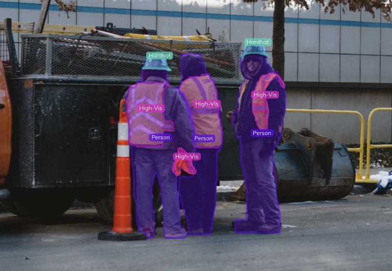

---

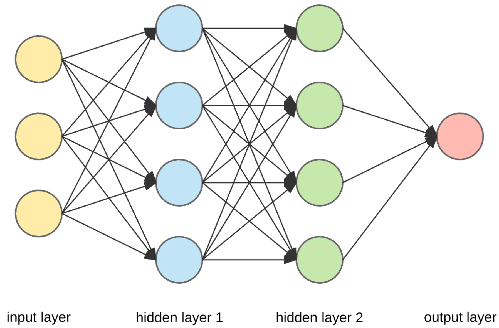

---

# Adversial AI

---

<video controls="controls" width="auto" src="horse.mp4">
</video>

---

<video controls="controls" width="auto" src="Youshallnotpass.mp4">
</video>

---

<video controls="controls" width="auto" src="painting.mp4">
</video>

---

# Generative AI

---

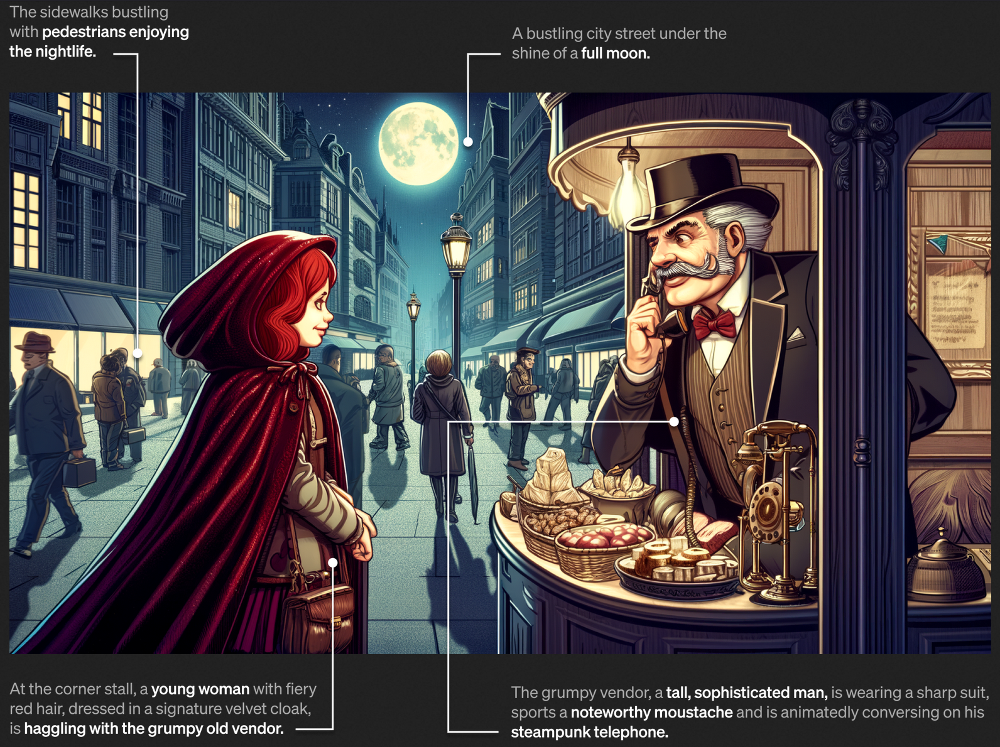

---

# Larry

---

<video controls="controls" width="auto" src="larry.mp4">
</video>

---

# Cognitive AI
#### I herd you like AI so we put some AI in AI so you can AI while you AI

---

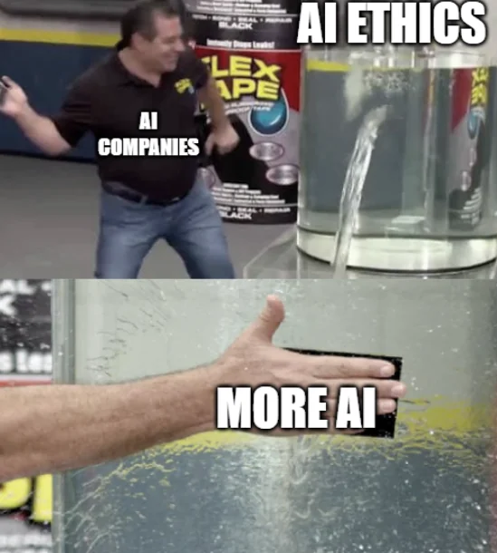

---


---


---

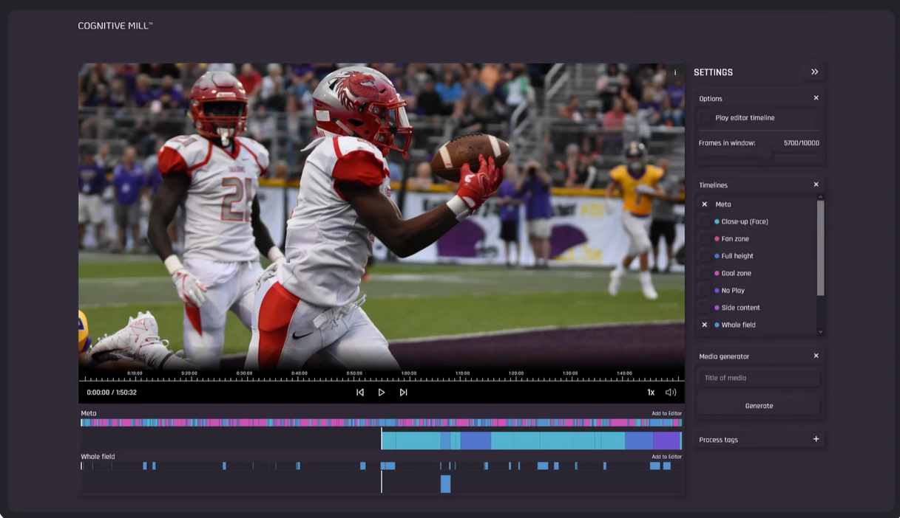

---

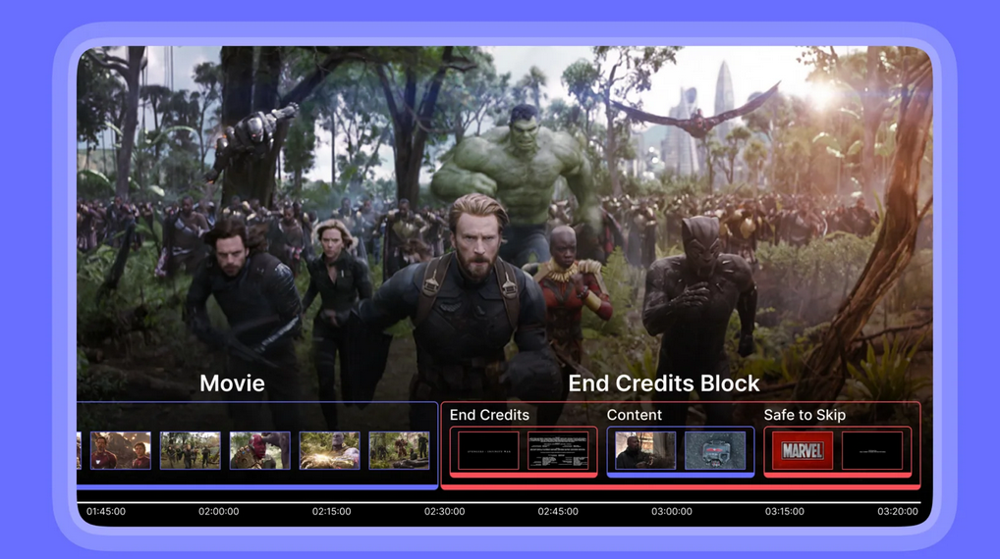

---

# How not to AI

---


---

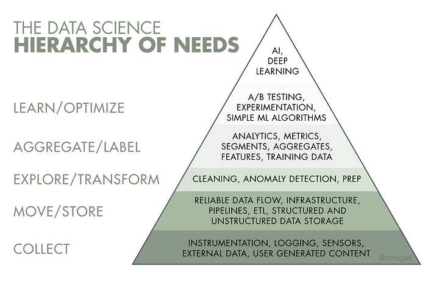

---

# Data **FIRST**

---

Bad data
Rigid pipeline
Framented data

---

# Platforms

---

# Conclusion


---


---

# **Next up: 03/12/2023**
<p></p>
<p></p>
<p></p>
<p></p>
<p></p>
<p></p>
<p></p>
<p></p>
<p></p>
<p></p>
<p></p>
<p></p>
<p></p>
<p></p>
<p></p>
<p></p>
<p></p>
<p></p>

### ``Name - **TODO("Not implemented")**``
<p></p>
<p></p>
<p></p>
<p></p>
<p></p>
<p></p>


---

# Sources