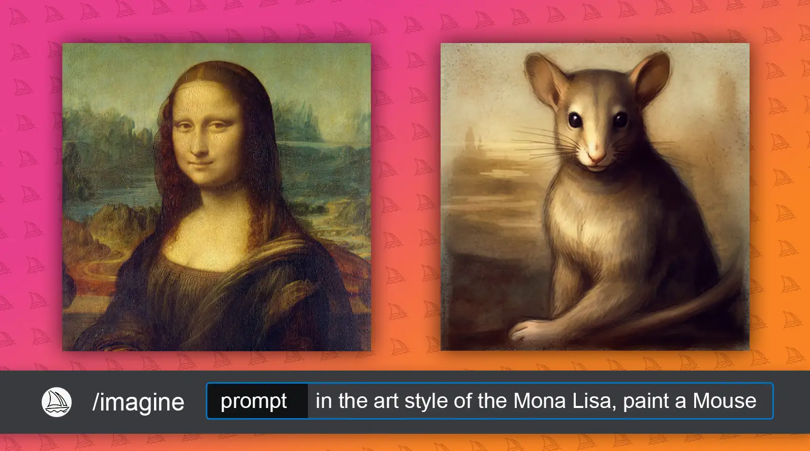
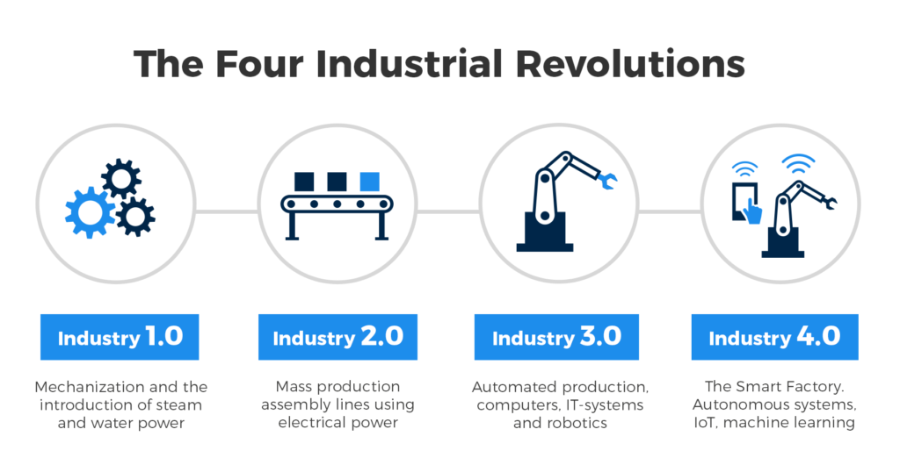

---

# How (not) to (use) AI

---
# What are we talking about 
```
$ whoami
Wtf is AI
Machine vision
Larry
Generative AI
Unsupervised AI
Manufacturing
Hardware & Platform
Take it to the cloud
```
---
```bash
tleilaxu@axians:~$ whoami
Name: Kenneth Van den Driessche
Work: Axians
Time: 5y1m1d19h
Current job: Consultant@Pfizer
```
---
Previously:
Social media platform developement @ travel sector
Development of backoffice software and network architecture @ event sector
Create a more data-driven organisation @ shipping

---

Be customer oriented
Be team fix it - deadlines not optional
Data is valuable

---
# Smart factory technology Innovation Technical consultant
##### (Whatever that means)

---

# Machine vision

---

#### Deep learning vs traditional Computer vision


---


---


---
### Pose estimation


---

### PPE detection


---


---

# Adversial AI

---

<video controls="controls" width="auto" src="horse.mp4">
</video>

---

<video controls="controls" width="auto" src="Youshallnotpass.mp4">
</video>

---

<video controls="controls" width="auto" src="painting.mp4">
</video>

---
# <span style="color:white">Generative AI</span>



---


---


---

# Larry

---

<video controls="controls" width="auto" src="larry.mp4">
</video>

---

# Cognitive AI
#### I herd you like AI so we put some AI in AI so you can AI while you AI

---


---


---


---


---


---

# Applications

---

Talk to production line

---

Expected
```
Prompt:
What whas the avrage temperature for the current production item
Answer:
15C
```

---

Early gpt example
```
Prompt:
Please find the lowest Amount in the table below.
| Description | Amount |
| Pants       | 5      |
| Skirt       | 5      |
| Shoes       | 5      |
-------------------------------------------------
Response:
| Panda       | 5      |
| Tie         | 5      |
| Glasses     | 5      |

```
---

Generative AI will never be 100% reliable.

---

Generate a event log, and use AI to scroll to the right position.

---

# How not to AI

---



---


---

# Data **FIRST**

---

# Why not generate the data for you model
Bad data
Rigid pipeline
Framented data

---


---

Questions?

---


---

# **Next up: 05/12/2023**
<p></p>
<p></p>
<p></p>
<p></p>
<p></p>
<p></p>
<p></p>
<p></p>
<p></p>
<p></p>
<p></p>
<p></p>
<p></p>
<p></p>
<p></p>
<p></p>
<p></p>
<p></p>

### ``Open space``
<p></p>
<p></p>
<p></p>
<p></p>
<p></p>
<p></p>


---
https://github.com/tl3ilaxu/aitalk